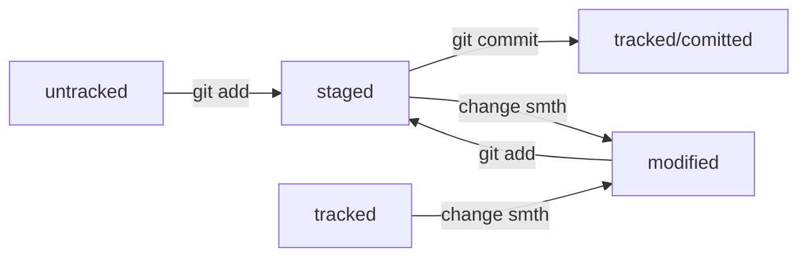

# Yandex Practicum repository
Hey there, this is my YA - practicum repository.  
Here are some my notes from this practicum: 
> [!NOTE]
> This repository will be updated gradually, while I'm mastering my Git skills.

## Notes
💡 Для обозначения систем контроля версий используют не только аббревиатуру VCS(Version control system), но и **SCM** (от англ. ***S**ource **C**ontrol **M**anagement* — «система управления исходным кодом»).

Изменение(группа изменений) - ревизия(версия)

Основные функции системы контроля версий:

- хранит историю изменений в виде отдельных ревизий;
- позволяет манипулировать историей: например, менять порядок ревизий, полностью удалять версии, возвращаться назад в истории;
- помогает анализировать изменения: например, кто и когда вносит изменения, кто чаще всего вносит изменения в определённый файл и так далее.

Немного о Git:

- консольный инструмент для работы с локальными и удалёнными репозиториями;
- проект с открытым исходным кодом.
GitHub:
- платформа для размещения удалённых репозиториев;
- принадлежит компании Microsoft.

💡 **Как расшифровывается Git?**

На английском сленге слово git означает «мерзавец». Но, по мнению Линуса Торвальдса, создателя Git, название может расшифровываться как угодно — в зависимости от настроения пользователя.

Например, Global Information Tracker (англ. «глобальный информационный трекер») — когда у вас всё хорошо и Git работает отлично. А если что-то идёт не так, Git превращается в Goddamn Idiotic Truckload of sh*t (англ. «чёртов идиотский грузовик c ...» — тут вы наверняка справитесь с переводом и без нас).  

💡 **Чем отличается запоминание от сохранения?**

Команда `git add` не сохраняет содержимое файлов в репозитории. Само сохранение, или фиксацию состояния файлов, называют **коммитом** (от англ. *commit* — «совершать», «фиксировать»). «Сделать коммит» значит сохранить текущую версию файла.

Если провести аналогию, команду `git add` можно сравнить с добавлением товаров в корзину в интернет-магазине, а коммит — с оформлением и оплатой заказа.

**Коммит** — это одна из основных сущностей в Git (и в других системах контроля версий). Коммит гарантирует, что изменения будут сохранены в истории и при необходимости к ним можно будет «откатиться». Это как если бы вы могли выполнить операцию `Ctrl+Z` для целой папки (репозитория).

Интересно, что цифры в этих строках:

`create mode 100644 .DS_Store` показывают права доступа к добавленному файлу(то, что проходим на осях).

## Useful commands
1) С помощью && можно выполнить несколько команд сразу — одну за другой.   
2) **Задать почту и ник** 
```bash
$ git config --global user.name "User Namovich" 
# имя или ник нужно написать латиницей и в кавычках

$ git config --global user.email username@yandex.ru
# здесь нужно указать свой настоящий email 
```
3) **Посмотреть файл конфигурации**
```bash
nano ~/.gitconfig
```
4) **Разгитить папку**
```bash
$ rm -rf .git # удалили подпапку .git 
# -r - рекурсивно, -f - forced - заставить
```
5) **Отслеживать все неотслеживаемые файлы**
```bash
$ git add --all
```

## What's HEAD
Файл ```HEAD``` (англ. «голова», «головной») — один из служебных файлов папки .git. Он указывает на коммит, который сделан последним (то есть на самый новый).
В этом файле хранится “ссылка” на файл с последним коммитом. Например можно увидеть что-то такое:

`cat HEAD` → `ref: refs/heads/main`

И если мы откроем файл стоящий после ref, то увидим там:

`cat refs/heads/main` → `ff3ab3c41ddbf6210d5ceeeb05e29364f2bb4986`
А это хэш последнего коммита.  
Полезная фича💡: Если нужно передать последний коммит, то вместо его хеша можно просто написать слово `HEAD` — Git поймёт, что вы имели в виду последний коммит.

## Hash in Git? 👀
Хеширование (от англ. hash, «рубить», «крошить», «мешанина») — это способ преобразовать набор данных и получить их «отпечаток» (англ. fingerprint).  
Git хеширует информацию о коммите с помощью алгоритма **SHA-1** (от англ. ***S**ecure **H**ash **A**lgorithm* — «безопасный алгоритм хеширования») и получает для каждого коммита свой уникальный **хеш** — результат хеширования.

Хэш представляет собой строку. В случае SHA-1 она имеет длину 40 и состоит из символов A-F(заглавные + строчные) и 0-9. 

- Важно заметить, что для одинакового набора файлов гит **гарантировано** выдаст одинаковый хэш.
    
    То есть: Если посчитать хеш одного и того же файла (одним и тем же алгоритмом) на двух разных компьютерах, то результат будет гарантированно одинаковым.
    
- Если же мы поменяем хотя бы один символ в каком-то файле, то хэш изменится (причем сильно).
### HashTable in Git 🤨
Интересно, что Git хранит информацию о коммитах в виде таблицы соответствия: хэш - информация о коммите. Эта инфа хранится в служебных файлах, которые находятся в скрытой папке .git. 

## File status
Каждый файл в гите имеет какой-то статус. Основные можно выделить так:

- **`untracked`**
    
    Мы говорили, что новые файлы в Git-репозитории помечаются как `untracked`, то есть неотслеживаемые. Git «видит», что такой файл существует, но не следит за изменениями в нём. У `untracked`файла нет предыдущих версий, зафиксированных в коммитах или через команду `git add`.
    
    То есть, по факту, это все файлы, которые мы создали, но ни разу не делали git add или git commit. Они как бы есть, но не в гите (хотя он их видит)
    
- **`staged`**
    
    После выполнения команды `git add` файл попадает в **staging area**, то есть в список файлов, которые войдут в коммит. В этот момент файл находится в состоянии `staged`.

- **`tracked`**
    
    Состояние `tracked` — это противоположность `untracked`. Оно довольно широкое по смыслу: в него попадают файлы, которые уже были зафиксированы с помощью `git commit`, а также файлы, которые были добавлены в staging area командой `git add`. То есть все файлы, в которых Git так или иначе отслеживает изменения.

- **`modified`**
    
    Состояние `modified` означает, что Git сравнил содержимое файла с последней сохранённой версией и нашёл отличия. Например, файл был закоммичен и после этого изменён.
    

Но стоит заметить одну вещь о `staged` и `modified`: 

`git add` добавляет в подготовленные (staged) файлы только текущее состояние файла. То есть, например, мы сделали `git add important.txt`, а затем изменили содержимое файла important.txt неким образом. Тогда в staged состоянии у нас будет только “предыдущая” (неизмененная) версия. Git скажет об этом с помощью указания того, что файл important.txt - `modified`. Что иметь в подготовленных самую последнюю версию надо еще раз сделать `git add important.txt`.

### Easily understands status



## Additional info
As you probably understood, I won't write code in this repository, 
but you can take a look at my other repos.

## Contact info
Find me here [Telegram](t.me/devilsolicitor "My cool TG")
